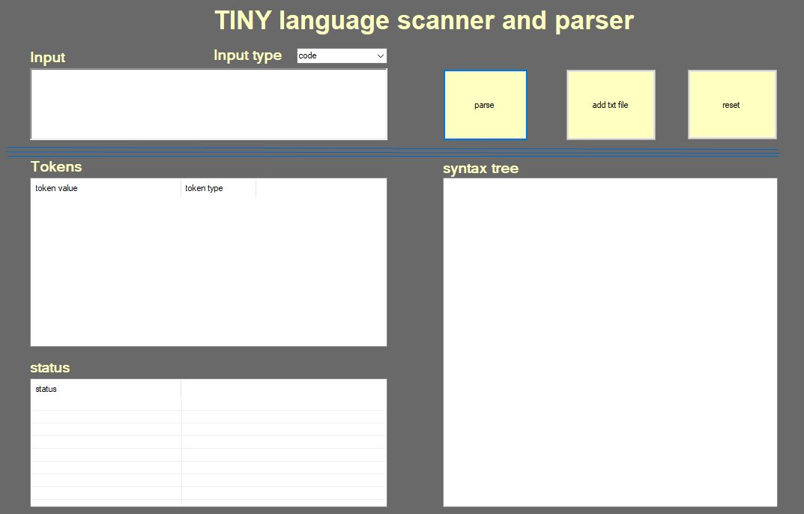
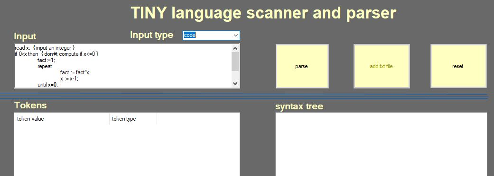
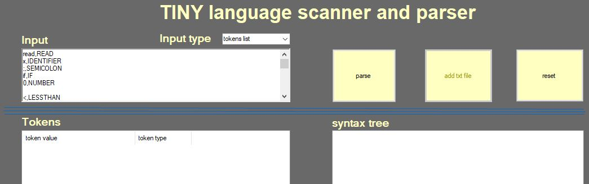
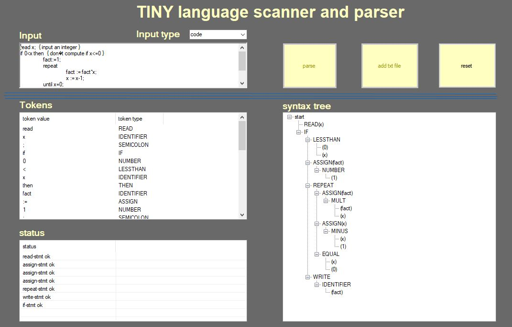

# TINY LANGUAGE PARSER

this application is used to do the second step in compiling code which Parsing tokens
 

# HOW TO USE?

	1. run parser.exe

	2. Select input type to be code then Add your code in the first textbox or you can add text file with your code

	3. You add token lisk as well by selecting token list from combo box

	4. press PARSE button

	
	
	5. you will get a syntax tree of your code or your token list
	

